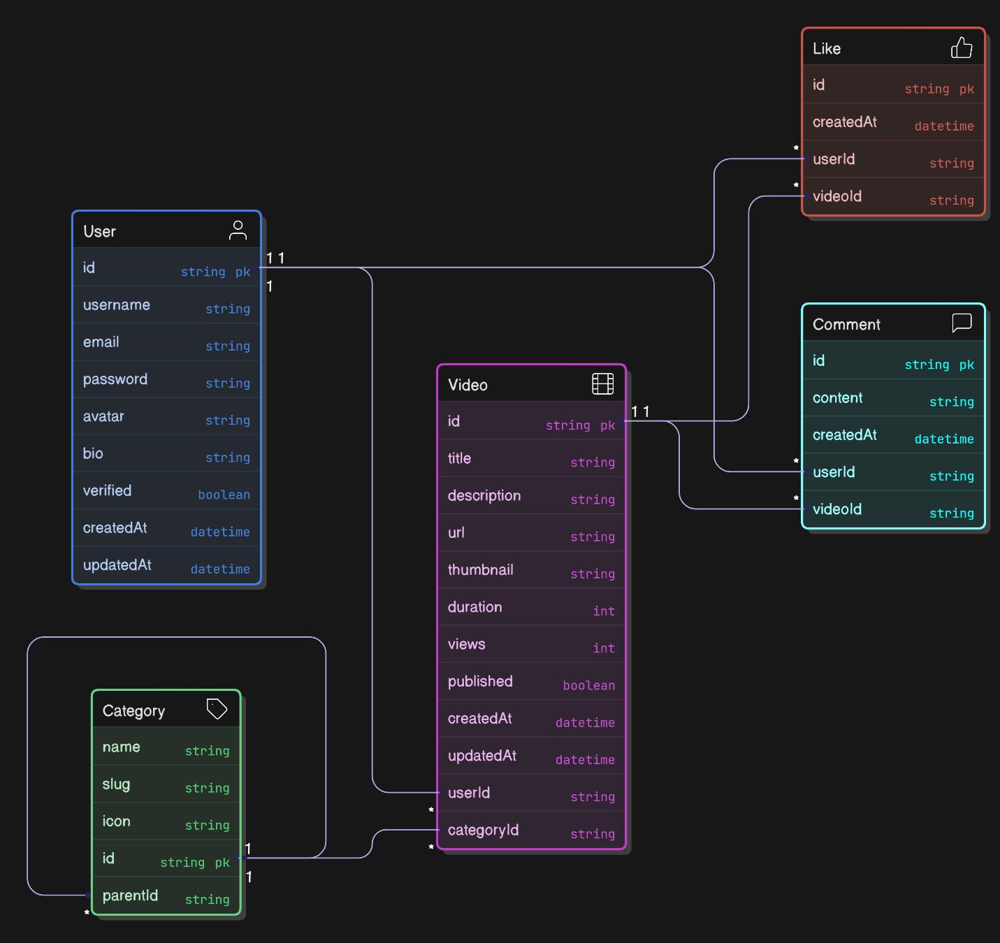
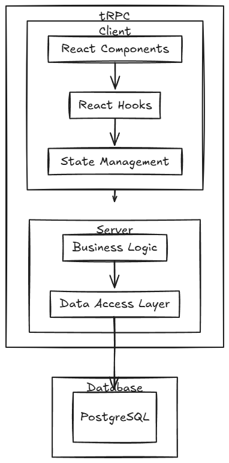
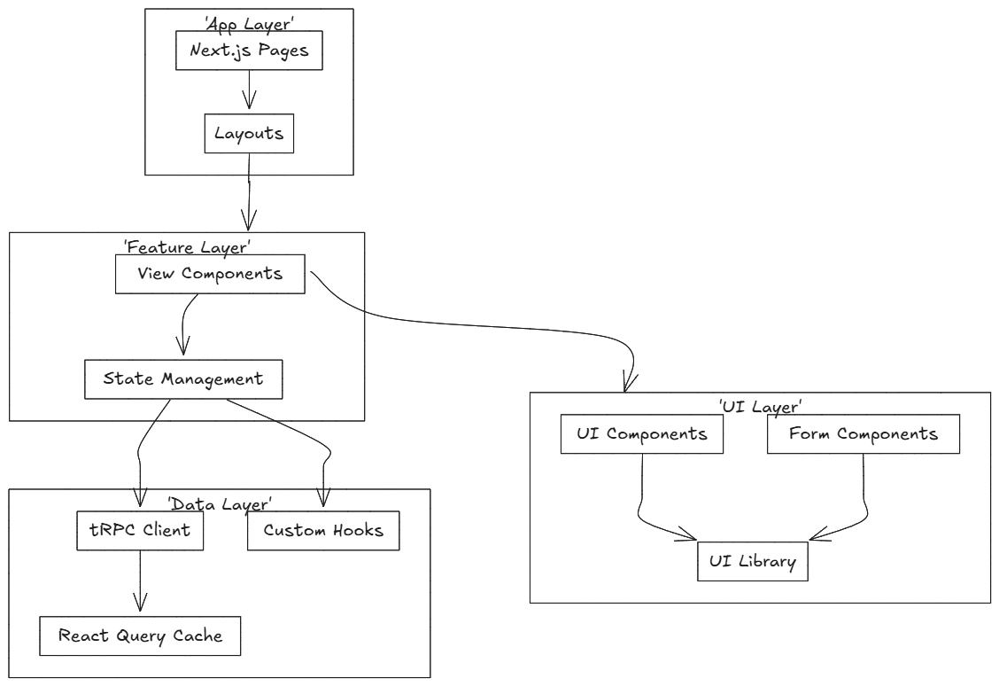

# VidGram - Video Sharing Platform

## Overview

**VidGram** is a modern video sharing platform that combines the best features of Instagram and YouTube, allowing users to upload, discover, and engage with short and long-form video content. Built with performance and user experience in mind, VidGram offers a responsive interface that works seamlessly across mobile and desktop devices.

## 🛠️ Tech Stack

- **Frontend**: Next.js 15, React, TypeScript, TailwindCSS
- **Backend**: tRPC, Node.js
- **Database**: PostgreSQL with Prisma ORM
- **Authentication**: NextAuth.js
- **File Storage**: UploadThing
- **Video Transcoding** : MUX
- **Deployment**: Vercel

## 📁 Project Structure

```
vidgram/
├── prisma/
│   └── schema.prisma       # Database schema
├── public/
│   └── assets/             # Static assets
├── src/
│   ├── app/                # Next.js App Router
│   │   ├── (home)/         # Home route group
│   │   ├── (auth)/         # Authentication route group
│   │   ├── (studio)/       # Creator studio route group
│   │   └── api/            # API routes
│   ├── components/         # Shared UI components
│   │   ├── ui/             # Core UI components
│   │   └── forms/          # Form components
│   ├── lib/                # Utility functions
│   ├── modules/            # Feature modules
│   │   ├── home/           # Home page module
│   │   ├── studio/         # Studio module
│   │   ├── video/          # Video module
│   │   └── user/           # User module
│   ├── trpc/               # tRPC configuration
│   │   ├── client.ts       # Client-side config
│   │   ├── server.ts       # Server-side config
│   │   └── routers/        # API routers
│   ├── hooks/              # Custom React hooks
│   ├── store/              # State management
│   └── types/              # TypeScript type definitions
├── .env.example            # Example environment variables
├── next.config.js          # Next.js configuration
├── package.json            # Dependencies
└── tsconfig.json           # TypeScript configuration
```

## 🗄️ Database Schema


### Schema Details

```prisma
// Simplified schema.prisma

model User {
  id            String    @id @default(cuid())
  username      String    @unique
  email         String    @unique
  password      String?
  avatar        String?
  bio           String?
  verified      Boolean   @default(false)
  createdAt     DateTime  @default(now())
  updatedAt     DateTime  @updatedAt
  videos        Video[]
  comments      Comment[]
  likes         Like[]
}

model Video {
  id          String    @id @default(cuid())
  title       String
  description String?
  url         String
  thumbnail   String?
  duration    Int
  views       Int       @default(0)
  published   Boolean   @default(false)
  createdAt   DateTime  @default(now())
  updatedAt   DateTime  @updatedAt
  userId      String
  user        User      @relation(fields: [userId], references: [id])
  categoryId  String
  category    Category  @relation(fields: [categoryId], references: [id])
  comments    Comment[]
  likes       Like[]
}

model Category {
  id        String     @id @default(cuid())
  name      String
  slug      String     @unique
  icon      String?
  parentId  String?
  parent    Category?  @relation("SubCategories", fields: [parentId], references: [id])
  children  Category[] @relation("SubCategories")
  videos    Video[]
}

model Comment {
  id        String   @id @default(cuid())
  content   String
  createdAt DateTime @default(now())
  userId    String
  user      User     @relation(fields: [userId], references: [id])
  videoId   String
  video     Video    @relation(fields: [videoId], references: [id])
}

model Like {
  id        String   @id @default(cuid())
  createdAt DateTime @default(now())
  userId    String
  user      User     @relation(fields: [userId], references: [id])
  videoId   String
  video     Video    @relation(fields: [videoId], references: [id])

  @@unique([userId, videoId])
}
```

## 🏗️ Architecture

VidGram follows a modular architecture with a clear separation of concerns:

### Client-Server Architecture with tRPC


### Frontend Architecture


### Backend Architecture


## 🚀 Getting Started

### Prerequisites

- Node.js 18+ and npm/yarn/bun
- PostgreSQL database
- Git

### Project Setup

1. Clone the repository:
   ```bash
   git clone https://github.com/yourusername/vidgram.git
   cd vidgram
   ```

2. Install dependencies:
   ```bash
   npm install
   # or
   yarn install
   # or
   bun install
   ```

3. Set up environment variables:
   ```bash
   cp .env.example .env.local
   # Edit .env.local with your database credentials and API keys
   ```

4. Set up the database:
   ```bash
   npx prisma migrate dev
   npx prisma generate
   ```

5. Run the development server:
   ```bash
   npm run dev
   # or
   yarn dev
   # or
   bun dev
   ```

## 💻 Development Workflow

### Running in Development Mode

```bash
npm run dev
```

### Building for Production

```bash
npm run build
```

### Running Tests

```bash
npm run test
```

Built with 💖 by [Nerdy Abhi](https://github.com/nerdyabhi)
